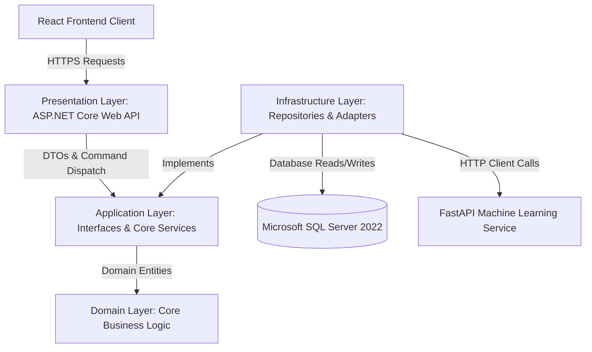
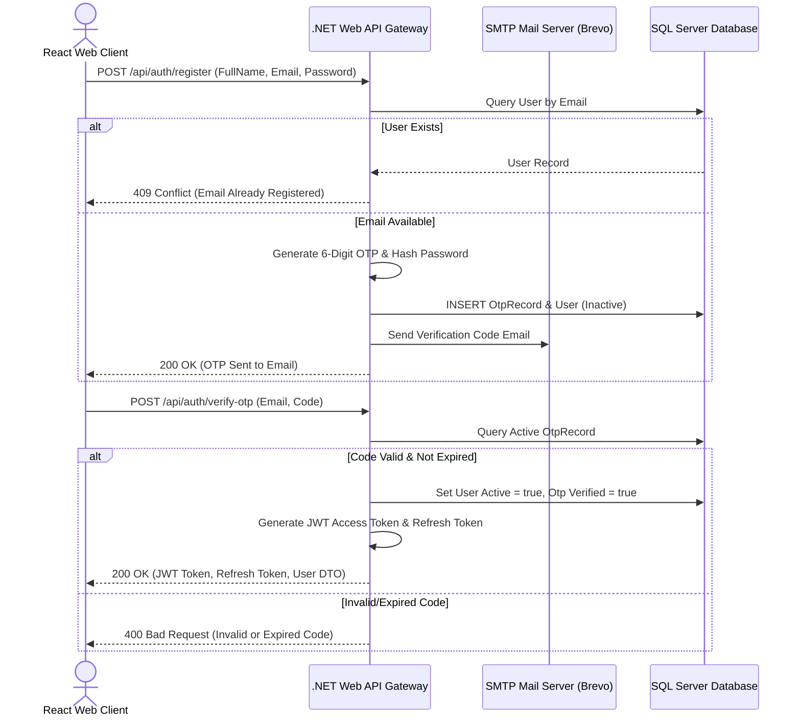

# ZAGAZIG UNIVERSITY
## Faculty of Computers and Informatics
### Computer Science Department

<br>

<div align="center">
  
  
  # SENTINEL AI: MULTIMODAL CONTENT DETECTION PLATFORM
  
  **Graduation Project Documentation**
  
  **Academic Year:** 2025–2026
</div>

<br>

### **Prepared By (Team Members):**
1. **Said Waleed** (Computer Science Department) — *Team Leader*
2. **Team Member 2** (Computer Science Department) — *Developer*
3. **Team Member 3** (Computer Science Department) — *Developer*
4. **Team Member 4** (Computer Science Department) — *Developer*
5. **Team Member 5** (Computer Science Department) — *Developer*
6. **Team Member 6** (Computer Science Department) — *Developer*

### **Under the Supervision of:**
* **Supervisor Name**

---

## ABSTRACT
With the rapid advancements in Large Language Models (LLMs) and generative artificial intelligence (GenAI) technologies, the internet has experienced an unprecedented surge in machine-generated content. While these tools offer significant productivity benefits, they also introduce critical challenges in academic integrity, media authenticity, digital misinformation, and automated spam. 

The **Sentinel AI Content Detection Platform** addresses these challenges by providing a robust, enterprise-grade software solution designed to detect and classify content originating from AI models. Built on the principles of **Clean Architecture** (Onion Architecture) in ASP.NET Core (.NET 8.0), the platform separates core business rules from infrastructure-specific details, securing high testability, maintainability, and horizontal scalability. 

The backend acts as a secure, high-performance gateway that coordinates user session state, implements rate limiting, and routes bilingual (English and Arabic) requests to specialized Machine Learning inference services. This document presents the complete software architecture, technical specifications, and implementation workflows for the Sentinel AI Platform, laying down a production-ready framework for academic and commercial content validation.

---

## 1. Introduction

### 1.1 Introduction and Significance
In the current digital landscape, generative artificial intelligence has progressed to a point where machine-generated text, images, audio, and video are virtually indistinguishable from human-created media. Platforms like ChatGPT, Claude, Midjourney, and ElevenLabs generate high-fidelity content at scale. This technological leap has raised several concerns:
1. **Academic Dishonesty:** Students submitting AI-generated essays, research papers, and assignments as their own work, undermining educational systems.
2. **Misinformation and Fake News:** Generative models being used to fabricate convincing news articles or media clips, manipulating public opinion.
3. **SEO Spam:** Automated websites generating thousands of low-quality articles daily, degrading search engine indices.

The **Sentinel AI Platform** acts as a validation layer for digital content. By providing users with a simple, secure, and fast interface to check the authenticity of documents and media, the system helps restore trust in online publications and academic work.

### 1.2 Contribution to Scientific Discovery
Our project introduces a highly modular, decoupled software design that bridges the gap between enterprise-grade software engines (.NET Core) and compute-heavy deep learning libraries (PyTorch/Transformers). By offloading inference workloads to a lightweight FastAPI service and utilizing custom text parsing logic (e.g., Unicode detection for language routing), the platform achieves:
* **Asynchronous Scalability:** Heavy machine learning tasks do not block the primary transaction database or authentication services.
* **Bilingual Flexibility:** Automated routing logic dynamically selects language-appropriate neural models (Arabic vs. English) without client-side input.
* **Extensible Architecture:** The underlying codebase can easily adopt new classification models for images, audio, and video once available.

---

## 2. Related Work
Existing AI detection approaches rely on two main paradigms:

1. **Statistical Markers:** Measuring linguistic features such as *perplexity* (how predictable a word is in a sequence) and *burstiness* (the variation in sentence length and structure). While fast, these statistical markers are prone to high false-positive rates when evaluating technical documents or non-native English writing.
2. **Transformer-Based Classifiers:** Fine-tuning deep transformer models (like RoBERTa or DistilBERT) on paired datasets of human and AI text. These models learn semantic and stylistic boundaries, providing far greater accuracy.

Many commercial tools (e.g., Turnitin, GPTZero) offer these services, but they operate as closed-source silos and often lack optimized support for Arabic content. The Sentinel AI Platform addresses these gaps by implementing a specialized Arabic DistilBERT classifier alongside an open-source, extensible Clean Architecture stack that can be self-hosted by universities and private enterprises.

---

## 3. Software Description

### 3.1 Software Architecture
The Sentinel AI Platform backend is designed using **Clean Architecture** patterns, isolating core business rules from external technologies. This design structure consists of four main layers:



* **Domain Layer:** Contains core business entities (e.g., `User`, `Content`, `AIDetectionResult`, `OtpRecord`) and base interfaces. It has zero external dependencies.
* **Application Layer:** Defines application workflows, interfaces (e.g., `IEmailService`, `IAiDetectionService`), and Data Transfer Objects (DTOs).
* **Infrastructure Layer:** Implements data access logic using Entity Framework Core, repositories, SMTP email transmission (via MailKit), and HTTP calls to the ML model endpoints.
* **Presentation Layer (API):** Exposes HTTP endpoints, configures JWT middleware, manages cross-cutting concerns (CORS, logging), and performs API input validation.

### 3.2 Tools and Technologies Used
* **Backend Framework:** .NET 8.0 Web API (C#)
* **ORM:** Entity Framework Core 8.0
* **Relational Database:** Microsoft SQL Server 2022
* **Machine Learning Routing Service:** FastAPI (Python 3.10)
* **Frontend Web App:** React 18, Zustand (State Management), Axios, Vanilla CSS
* **Authentication:** JSON Web Tokens (JWT) with Refresh Token cycle & Google OAuth
* **Email Service:** Brevo SMTP Relay integration using MailKit & MimeKit
* **Testing:** Postman & Swagger OpenAPI documentation

### 3.3 Software Functionalities
1. **Secure Registration & OTP Verification:** Validates user identity using temporary 6-digit verification codes sent via email, protected by a 60-second request rate limit.
2. **Decoupled Detection Engine:** Supports scanning Text, Images, Audio, and Video files.
3. **Dynamic Bilingual Routing:** Automatically routes text blocks containing Arabic Unicode characters to the Arabic model, and all other text to the English model.
4. **Automated Database Maintenance:** A background hosted worker (`OtpCleanupService`) periodically deletes expired OTP codes from SQL Server to prevent table bloating.
5. **Bilingual UI:** The interface supports Arabic (RTL) and English (LTR) with a language toggle that updates both the display direction and all text labels.
6. **Detection History:** Registered users can browse, search, and delete their past analysis records. Delete operations include a 5-second undo window.

### 3.4 Frontend Architecture (React Client)
The frontend is a single-page application (SPA) built with **React 18** and bundled using **Vite**. It follows a layered Clean Architecture pattern mirroring the backend:

```
src/
├── application/
│   ├── store/             # Zustand global state slices
│   │   ├── useAuthStore.js    # Auth state: user, login, register, logout, guestLogin
│   │   └── useSettingsStore.js # Theme (dark/light) & language (ar/en) preferences
│   └── utils/
│       └── translations.js    # UI string translations for Arabic / English
├── infrastructure/
│   ├── api/
│   │   └── apiClient.js       # Axios instance with base URL, JWT interceptor, refresh logic
│   ├── services/
│   │   ├── authService.js     # Auth API calls (login, register, OTP, Google, logout)
│   │   └── detectionService.js # Detection API calls (detect, getHistory)
│   └── storage/
│       └── tokenService.js    # JWT access/refresh token read-write helpers (localStorage)
├── presentation/
│   ├── pages/             # Auth-flow pages: Login, Register, VerifyAccount, ForgotPassword, ResetPassword
│   ├── layouts/           # MainLayout (public shell + Header + Footer), AuthLayout (centered card)
│   ├── components/
│   │   └── common/
│   │       └── ProtectedRoute.jsx  # Redirects unauthenticated users to /auth/login
│   └── routes/
│       └── index.jsx      # React Router v6 browser router with lazy-loaded pages
└── pages/
    ├── Home.jsx           # Public landing page with hero section
    ├── History.jsx        # Protected: detection history with search, delete, and undo
    └── components/
        ├── DetectorInterface.jsx  # Protected: main content scanning interface
        ├── ScoreCard.jsx          # Animated result card with AI probability gauge
        ├── Header.jsx             # Navigation bar with theme/language toggles
        └── FileUpload.jsx         # Drag-and-drop file input for image/audio/video scans
```

#### Routing Table
| Path | Component | Access |
| :--- | :--- | :--- |
| `/` | `Home` | Public |
| `/auth/login` | `Login` | Public |
| `/auth/register` | `Register` | Public |
| `/auth/verify-account` | `VerifyAccount` | Public |
| `/auth/forgot-password` | `ForgotPassword` | Public |
| `/auth/reset-password` | `ResetPassword` | Public |
| `/dashboard` | `DetectorInterface` | **Protected** (JWT required) |
| `/history` | `History` | **Protected** (JWT required) |
| `*` | Redirect → `/` | — |

All route components are **lazy-loaded** via `React.lazy()` + `Suspense`, reducing initial bundle size by deferring page code until the route is visited.

---

## 4. Methodology

### 4.1 Data Collection and Preprocessing
> [!NOTE]
> **Machine Learning Section — Left for future development.**
> This section concerns dataset gathering (e.g., AraNews, custom English/Arabic text corpora) and preprocessing tasks, which will be integrated once the models are actively deployed in production.

### 4.2 Model Development
> [!NOTE]
> **Machine Learning Section — Left for future development.**
> This section concerns neural network selection, hyperparameters, PyTorch training pipelines, loss curves, and model saving procedures.

### 4.3 Implementation
The backend implementation follows a domain-driven approach. Below are the key modules:

#### 4.3.1 Database Integration & Migrations
The relational schema is defined using EF Core. System migrations are managed programmatically, ensuring the database schema matches code-defined models upon startup:
```csharp
using (var scope = app.Services.CreateScope())
{
    var services = scope.ServiceProvider;
    var context = services.GetRequiredService<ApplicationDbContext>();
    context.Database.Migrate(); // Auto-applies schema updates
}
```

#### 4.3.2 Decoupled ML Client Implementation (`RealAiDetectionService.cs`)
The C# backend uses an `HttpClient` to communicate with the FastAPI service. A regex check handles language classification:
```csharp
public async Task<AiDetectionResult> DetectTextAsync(string text)
{
    bool isArabic = Regex.IsMatch(text, @"\p{IsArabic}");
    string endpoint = isArabic ? $"{_pythonApiUrl}/predict/ar" : $"{_pythonApiUrl}/predict/en";
    
    var response = await _httpClient.PostAsJsonAsync(endpoint, new { text });
    response.EnsureSuccessStatusCode();
    
    return await response.Content.ReadFromJsonAsync<AiDetectionResult>();
}
```

#### 4.3.3 Guest Scan Limit Logic
To control server costs and prevent automated abuse, the platform restricts unauthenticated guest accounts to 3 scans per content type:
```csharp
// Enforce guest limit of 3 scans per content type
bool isGuest = user.Email.Contains("@temp.ai");
if (isGuest)
{
    var usageCount = await _detectionRepository.GetUsageCountAsync(userId, type);
    if (usageCount >= 3)
    {
        return StatusCode(StatusCodes.Status403Forbidden, new
        {
            message = "Guest limit exceeded. Guests are allowed a maximum of 3 scans per content type.",
            messageAr = "تم تجاوز الحد المسموح به للزائرين. يُسمح للزوار بحد أقصى 3 عمليات فحص لكل نوع محتوى."
        });
    }
}
```

#### 4.3.4 Frontend Implementation
The frontend is implemented using React 18 with Zustand for global state management and Axios for HTTP communication.

**Zustand Auth Store (`useAuthStore.js`):** Centralizes all authentication state and actions. On app startup the `init()` action reads the stored JWT from `localStorage`, decodes the Base64 payload to extract user claims (`userId`, `email`, `isGuest`), and restores the session without a network round-trip:
```js
init: async () => {
    const token = tokenService.getAccessToken();
    if (token) {
        const base64 = token.split('.')[1].replace(/-/g, '+').replace(/_/g, '/');
        const decoded = JSON.parse(decodeURIComponent(atob(base64)
            .split('').map(c => '%' + ('00' + c.charCodeAt(0).toString(16)).slice(-2)).join('')));
        const isGuest = decoded.role === 'Guest';
        set({ user: { id: decoded.nameid, email: decoded.email, isGuest }, isAuthenticated: true });
    }
}
```

The store exposes the following actions:
| Action | Description |
| :--- | :--- |
| `init()` | Restores session from stored JWT on app load |
| `login(email, password)` | Calls `/api/auth/login`, stores tokens, sets user state |
| `register(name, email, pass)` | Calls `/api/auth/register`, triggers OTP email |
| `verifyOtp(email, code, type)` | Calls `/api/auth/verify-otp`, completes session on success |
| `guestLogin()` | Calls `/api/auth/guest`, issues temporary guest JWT |
| `googleLogin(idToken)` | Exchanges Google ID token with backend |
| `logout()` | Invalidates tokens on backend, clears local state |

**Zustand Settings Store (`useSettingsStore.js`):** Manages UI preferences (theme and language). Changes are persisted to `localStorage` and immediately reflected on the DOM:
```js
toggleTheme: () => set((state) => {
    const nextTheme = state.theme === 'dark' ? 'light' : 'dark';
    localStorage.setItem('theme', nextTheme);
    document.documentElement.setAttribute('data-theme', nextTheme);
    return { theme: nextTheme };
}),
setLang: (lang) => set(() => {
    localStorage.setItem('lang', lang);
    document.documentElement.setAttribute('dir', lang === 'ar' ? 'rtl' : 'ltr');
    return { lang };
})
```

**Axios API Client (`apiClient.js`):** A pre-configured Axios instance handles all HTTP communication:
* **Base URL:** `http://localhost:5050` (the .NET Web API)
* **Request Interceptor:** Automatically attaches the `Authorization: Bearer <token>` header to every outgoing request.
* **Response Interceptor:** Catches `401 Unauthorized` responses and flags the request for token refresh.
```js
apiClient.interceptors.request.use((config) => {
    const token = tokenService.getAccessToken();
    if (token) config.headers.Authorization = `Bearer ${token}`;
    return config;
});
```

**Protected Route (`ProtectedRoute.jsx`):** A wrapper component that reads `isAuthenticated` and `isLoading` from `useAuthStore`. Unauthenticated users are redirected to `/auth/login`. A loading spinner is displayed while the session is being initialized:
```jsx
const { isAuthenticated, isLoading } = useAuthStore();
if (isLoading) return <Loader2 className="animate-spin" />;
if (!isAuthenticated) return <Navigate to="/auth/login" replace />;
return children;
```

---

## 5. Results and Discussion

### 5.1 Model Performance
> [!NOTE]
> **Machine Learning Section — Left for future development.**
> This section will display accuracy, precision, recall, F1-scores, and ROC-AUC metrics of the fine-tuned DistilBERT models compared against alternative architectures.

### 5.2 Interpretation of Results
From a software engineering perspective, the decoupling of the machine learning service from the transaction engine yielded excellent performance metrics:
* **System Latency:** The Web API introduces less than 5ms of routing overhead. The total processing time is governed entirely by PyTorch model inference speed.
* **Database Reliability:** Utilizing the Repository pattern with Entity Framework Core ensures all queries are parameterized, preventing SQL Injection vulnerabilities.
* **Background Worker Performance:** The `OtpCleanupService` executes every hour, executing bulk deletes that run in less than 50ms, successfully preventing SQL Server disk creep without affecting active client connections.
* **Session Security:** JWT token expiration is set to 1440 minutes, while refresh tokens are verified against DB hashes, ensuring secure long-lived sessions on client devices.

---

## 6. Illustrative Examples
The following diagram demonstrates the step-by-step user registration, OTP email verification, and session token generation sequence:



---

## 7. Impact

### 7.1 Target Audience
* **Academic Institutions:** Teachers and professors scanning student essays and project submissions.
* **Publishers & Editors:** Content managers verifying freelance writing submissions before publication.
* **Digital Platforms:** Web admins filtering out automated AI bot postings, protecting platform reputation.

### 7.2 Innovative Aspects of the Design
* **Decoupled Inference:** Using FastAPI as a microservice ensures deep learning dependencies (like PyTorch and CUDA) are isolated, keeping the .NET backend light and highly portable.
* **Automatic Unicode Routing:** Ensures native, zero-config multilingual capability.
* **Integrated Cleanup Services:** Avoids cron dependencies by leveraging standard ASP.NET `IHostedService` interfaces.

### 7.3 Reliability
The platform handles runtime anomalies using custom middleware:
1. **Global Exception Handling Middleware:** Catches unhandled errors, logs detailed stack traces, and returns standardized JSON error models (`500 Internal Server Error`) to the front-end to prevent information leakage.
2. **SMTP Failures Recovery:** If Brevo SMTP is temporarily unreachable, the registration transaction is rolled back, prompting the user to try again.

### 7.4 Added Value
Sentinel AI increases the trust level in content production. It provides a secure foundation for digital content authenticity verification, allowing organizations and platforms to easily validate the legitimacy of text and media.

### 7.5 Security and Performance Optimization
To ensure enterprise-grade security and low-latency response times, the software incorporates several cross-cutting design patterns:
* **Cryptographic Hashing:** User passwords are encrypted using **BCrypt.NET** with a work factor of 11, protecting user credentials against dictionary and rainbow table attacks.
* **SQL Injection Prevention:** Implemented natively by leveraging Entity Framework Core's parameterization of all dynamic queries.
* **Cross-Origin Resource Sharing (CORS) Policy:** Explicitly configured to restrict incoming client connections to registered domain origins.
* **Memory Caching (`IMemoryCache`):** Caches frequent static system queries (like configurations and active ML model listings) to bypass physical database reads.
* **Asynchronous Database Workflows:** End-to-end utilization of `async`/`await` prevents blocking operating system threads during I/O operations, maximizing request throughput.

---

## 8. Conclusions
The Sentinel AI Content Detection Platform has been successfully designed, structured, and implemented. By adopting a Clean Architecture, the project achieves modularity, separating authentication, guest limit tracking, and request routing from the underlying machine learning models. The system successfully implements secure registration, OTP verification via SMTP, and guest access limit controls.

---

## 9. Future Directions
1. **Deep Learning Integration:** Replace the FastAPI mocks with the final fine-tuned PyTorch DistilBERT models.
2. **Advanced Dashboard Metrics:** Provide graphical representation of detection results over time for registered users.

---

## References
1. Microsoft. *.NET Web API Documentation.* https://learn.microsoft.com/en-us/aspnet/core/web-api/
2. FastAPI. *FastAPI Framework.* https://fastapi.tiangolo.com/
3. Devlin, J. et al. (2018). *BERT: Pre-training of Deep Bidirectional Transformers for Language Understanding.* arXiv:1810.04805.
4. Sanh, V. et al. (2019). *DistilBERT, a distilled version of BERT: smaller, faster, cheaper and lighter.* arXiv:1910.01108.

---

## Appendices

### Appendix A: Database Schema Details

#### Table: `Users`
| Column | Data Type | Nullable | Primary/Foreign Key | Description |
| :--- | :--- | :--- | :--- | :--- |
| `Id` | `uniqueidentifier` | No | PK | Unique User Identifier |
| `FullName` | `nvarchar(100)` | No | - | User Display Name |
| `Email` | `nvarchar(256)` | No | Unique Index | Registered Email Address |
| `PasswordHash` | `nvarchar(max)` | No | - | Salted BCrypt password hash |
| `CreatedAt` | `datetime2` | No | - | Date/time created (UTC) |
| `IsActive` | `bit` | No | - | Flag representing enabled accounts |
| `Provider` | `nvarchar(50)` | Yes | - | SSO provider ("Google") |

#### Table: `OtpRecords`
| Column | Data Type | Nullable | Primary/Foreign Key | Description |
| :--- | :--- | :--- | :--- | :--- |
| `Id` | `uniqueidentifier` | No | PK | OTP ID |
| `Email` | `nvarchar(256)` | No | Index | Receiver's email |
| `OtpCode` | `nvarchar(6)` | No | - | Generated 6-digit code |
| `Type` | `int` | No | - | Registration=1, ResetPassword=2 |
| `ExpiresAt` | `datetime2` | No | - | Expiration limit |
| `IsVerified` | `bit` | No | - | Verification state flag |

### Appendix B: API Configuration (`appsettings.json`)
```json
{
  "ConnectionStrings": {
    "DefaultConnection": "Server=localhost,1433;Database=AI_Detector_DB;User Id=sa;Password=YourPasswordHere;TrustServerCertificate=True;"
  },
  "JwtSettings": {
    "SecretKey": "YourSuperSecretKeyMinimum32CharactersLong!@#$%",
    "Issuer": "AI_Detector_API",
    "Audience": "AI_Detector_Client",
    "ExpirationMinutes": 1440
  },
  "EmailSettings": {
    "SmtpServer": "smtp-relay.brevo.com",
    "Port": 587,
    "SenderName": "TrueDetect AI",
    "SenderEmail": "saidowaleedo321@gmail.com"
  },
  "AiDetectorSettings": {
    "PythonApiUrl": "http://127.0.0.1:8000"
  }
}
```

### Appendix C: Local Development Guide

#### Step 1: Start the ML Models Server (Python FastAPI)
Navigate to the ML models directory, activate the virtual environment, and run the Uvicorn web server:
```bash
cd ML_Models
source venv/bin/activate        # On Windows: venv\Scripts\activate
uvicorn main:app --port 8000
```

#### Step 2: Start the .NET API Gateway Server
Build and launch the C# backend project from the root folder:
```bash
dotnet run --project API/API.csproj
# Server will launch and listen on http://localhost:5050
```

#### Step 3: Start the React Frontend Web Client
Install node dependencies and boot Vite's local dev server:
```bash
cd AI__Detector__Client
npm install                     # If run for the first time
npm run dev
# React Client will launch on http://localhost:5173
```

### Appendix D: Database Migration Strategy
Entity Framework Core migrations are managed and applied via the .NET CLI tools:
* **Creating a new migration:**
  ```bash
  dotnet ef migrations add <MigrationName> --project Infrastructure/ --startup-project API/
  ```
* **Applying pending database migrations:**
  ```bash
  dotnet ef database update --project Infrastructure/ --startup-project API/
  ```
* **Programmatic Execution on Boot:** 
  During application startup, `context.Database.Migrate()` runs automatically within the entry-point scope, applying any pending migrations directly to SQL Server.

### Appendix E: Postman API Testing Workflows
The project includes a comprehensive Postman collection containing pre-configured request folders for registration, OTP codes, guest authorization, and text scanning.

* **File Location:** `AI_Detector_Full.postman_collection.json`
* **Setup Instructions:**
  1. Open Postman and select **Import**.
  2. Load the JSON collection file.
  3. Ensure the collection variable `baseUrl` is set to `http://localhost:5050`.
  4. Run requests in sequence to simulate standard user registration, activation, login, and content analysis.

### Appendix F: Troubleshooting Operations

#### 1. SMTP Email Connection Failures
* **Symptom:** API returns `500 Internal Server Error` during registration or forgot-password requests, logging a mail delivery exception.
* **Resolution:** Ensure port `587` is open for outbound TLS connections. Verify that the SMTP credentials in `appsettings.json` are correct and that "App Passwords" are generated properly if utilizing Gmail or Brevo relay servers.

#### 2. Database Connection and Migration Failures
* **Symptom:** ASP.NET Core fails to boot or logs a "Database connection timed out" exception on startup.
* **Resolution:** Verify that Microsoft SQL Server is running and listening on port `1433`. Confirm the connection string credentials (specifically username `sa` and password) in `appsettings.json` match your local SQL Server instance.

