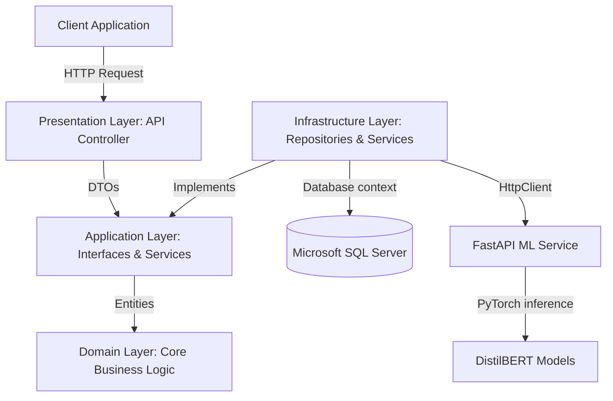
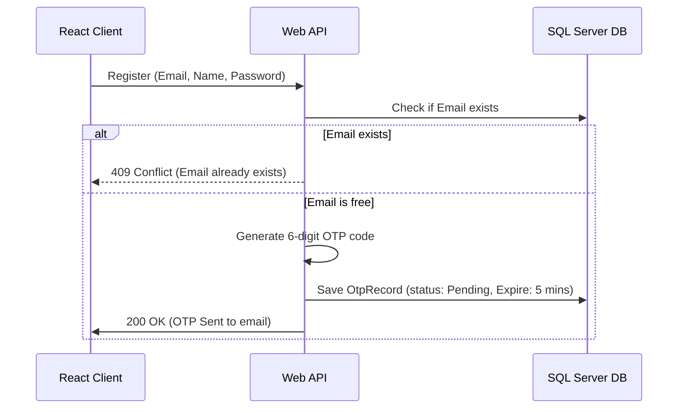

# 🤖 Sentinel AI Platform — Technical Documentation
## Complete Architecture, Implementation, and Deployment Guide
### Graduation Project Documentation

---

> **Project Title:** Sentinel AI Content Detection Platform  
> **Backend Framework:** .NET 8.0 (Web API)  
> **Machine Learning Service:** FastAPI (Python 3.10) & PyTorch (Transformers)  
> **Database:** Microsoft SQL Server 2022  
> **Frontend Client:** React 18, Zustand, Axios, Tailwind CSS  
> **Document Version:** v1.0.0 (Production-Ready)

---

## 📋 Table of Contents
1. [Project Overview & Vision](#1-project-overview--vision)
2. [High-Level Architecture](#2-high-level-architecture)
3. [Domain Layer (Entities & Core Rules)](#3-domain-layer-entities--core-rules)
4. [Application Layer (Interfaces & Contracts)](#4-application-layer-interfaces--contracts)
5. [Infrastructure Layer (Data Access & Repositories)](#5-infrastructure-layer-data-access--repositories)
6. [Presentation Layer (ASP.NET Core Web API)](#6-presentation-layer-aspnet-core-web-api)
7. [Database Schema Design](#7-database-schema-design)
8. [Identity & Authentication Engine](#8-identity--authentication-engine)
9. [OTP & Email Delivery Service](#9-otp--email-delivery-service)
10. [AI Models & FastAPI Integration](#10-ai-models--fastapi-integration)
11. [API Endpoints Reference](#11-api-endpoints-reference)
12. [Frontend Architecture (React Client)](#12-frontend-architecture-react-client)
13. [Zustand State Management](#13-zustand-state-management)
14. [Security & Cross-Cutting Concerns](#14-security--cross-cutting-concerns)
15. [Performance & Caching Strategy](#15-performance--caching-strategy)
16. [Dockerization & Production Deployment](#16-dockerization--production-deployment)
17. [Database Migration Strategy](#17-database-migration-strategy)
18. [Postman & Testing Workflows](#18-postman-testing-workflows)
19. [Troubleshooting & Maintenance Operations](#19-troubleshooting--maintenance-operations)
20. [Project Summary & Future Milestones](#20-project-summary--future-milestones)

---

## 1. Project Overview & Vision
The **Sentinel AI Platform** (formerly Authenticity Checker) is a comprehensive enterprise system designed to detect content generated by artificial intelligence. In an era dominated by large language models (LLMs) like GPT-4, Claude, and Gemini, detecting automated content is critical for maintaining academic integrity, fighting misinformation, and verifying digital assets.

### Core Objectives
* **Multimodal Detection:** Analyze Text, Images, Video, and Audio to determine AI origin.
* **Bilingual Support:** Specialized models for English and Arabic text classification.
* **Low Latency:** Millisecond-level processing times for enterprise-level scale.
* **Flexible Identity Management:** Support secure user registration, email verification via OTP, third-party authentication (Google), and seamless guest access.

---

## 2. High-Level Architecture
The backend is built using the principles of **Clean Architecture** (Onion Architecture), separating business rules from infrastructure details. This increases testability, maintainability, and independence from external libraries or database engines.



### Dependency Flow Rules
* **Domain Layer** has no dependencies on other layers.
* **Application Layer** depends only on the Domain Layer.
* **Infrastructure Layer** depends on the Application Layer.
* **Presentation Layer** depends on the Application Layer and references Infrastructure for Dependency Injection setup.

---

## 3. Domain Layer (Entities & Core Rules)
The Domain Layer defines the core entities, value objects, and repository interfaces. It represents the heart of the business logic.

### 1. User Entity (`Domain/Entities/User.cs`)
Represents a user registered in the system.
```csharp
public class User
{
    public Guid Id { get; set; }
    public string FullName { get; set; } = string.Empty;
    public string Email { get; set; } = string.Empty;
    public string PasswordHash { get; set; } = string.Empty;
    public DateTime CreatedAt { get; set; } = DateTime.UtcNow;
    public DateTime UpdatedAt { get; set; } = DateTime.UtcNow;
    public bool IsActive { get; set; } = true;
    public string? Provider { get; set; } // e.g., "Google"
    public string? ProviderId { get; set; }
    public string? RefreshToken { get; set; }
    public DateTime? RefreshTokenExpiry { get; set; }
    public ICollection<Content> Contents { get; set; } = new List<Content>();
}
```

### 2. Content Entity (`Domain/Entities/Content.cs`)
Represents raw text or media files uploaded for detection.
```csharp
public class Content
{
    public Guid Id { get; set; }
    public Guid UserId { get; set; }
    public ContentType Type { get; set; } // Text = 1, Image = 2, Video = 3, Audio = 4
    public string Data { get; set; } = string.Empty; // Holds text contents or media file path
    public DateTime UploadedAt { get; set; } = DateTime.UtcNow;
    public User User { get; set; } = null!;
    public ICollection<AIDetectionResult> DetectionResults { get; set; } = new List<AIDetectionResult>();
}
```

### 3. AIDetectionResult Entity (`Domain/Entities/AIDetectionResult.cs`)
Represents the result returned by a specific ML model for a content analysis request.
```csharp
public class AIDetectionResult
{
    public Guid Id { get; set; }
    public Guid ContentId { get; set; }
    public Guid AIModelId { get; set; }
    public double AiProbability { get; set; }
    public bool IsAiGenerated { get; set; }
    public string? Details { get; set; } // Stored as JSON metadata
    public DateTime AnalyzedAt { get; set; } = DateTime.UtcNow;
    public Content Content { get; set; } = null!;
    public AIModel AIModel { get; set; } = null!;
}
```

---

## 4. Application Layer (Interfaces & Contracts)
The Application Layer defines the application's use cases and contracts for external services. It defines Data Transfer Objects (DTOs) and repository interfaces.

### Core Interface: `IEmailService` (`Application/Interfaces/IEmailService.cs`)
Defines the contract for dispatching verification codes and password reset emails.
```csharp
public interface IEmailService
{
    Task SendVerificationCodeAsync(string email, string fullName, string code);
    Task SendPasswordResetCodeAsync(string email, string fullName, string code);
}
```

### Core Interface: `IAiDetectionService` (`Application/Interfaces/IAiDetectionService.cs`)
Defines the contract for connecting with the ML classification engine.
```csharp
public interface IAiDetectionService
{
    Task<AiDetectionResult> DetectTextAsync(string text);
    Task<AiDetectionResult> DetectImageAsync(string imagePath);
    Task<AiDetectionResult> DetectVideoAsync(string videoPath);
    Task<AiDetectionResult> DetectAudioAsync(string audioPath);
}
```

---

## 5. Infrastructure Layer (Data Access & Repositories)
The Infrastructure Layer implements the interfaces defined in the Application Layer. It contains Entity Framework Core contexts, repository implementations, and external service adapters.

### Repository Pattern with Specifications
Using the generic repository pattern allows querying data with encapsulated business queries using specifications (`ISpecification<T>`).

#### Base Repository Implementation (`Infrastructure/Repositories/GenericRepository.cs`):
```csharp
public class GenericRepository<T> : IGenericRepository<T> where T : class
{
    protected readonly ApplicationDbContext _context;

    public GenericRepository(ApplicationDbContext context)
    {
        _context = context;
    }

    public async Task<T?> GetByIdAsync(Guid id) => await _context.Set<T>().FindAsync(id);

    public async Task<T> AddAsync(T entity)
    {
        await _context.Set<T>().AddAsync(entity);
        await _context.SaveChangesAsync();
        return entity;
    }

    public async Task UpdateAsync(T entity)
    {
        _context.Set<T>().Update(entity);
        await _context.SaveChangesAsync();
    }
}
```

---

## 6. Presentation Layer (ASP.NET Core Web API)
The Presentation Layer acts as the gateway to the application. It exposes REST API endpoints, parses JSON payloads, validates forms, and coordinates the execution of Application workflows.

### Dependency Registration (`API/Program.cs`)
All services are mapped with specific lifetimes in the service container:
```csharp
builder.Services.AddDbContext<ApplicationDbContext>(options =>
    options.UseSqlServer(builder.Configuration.GetConnectionString("DefaultConnection"))
);

builder.Services.AddScoped(typeof(IGenericRepository<>), typeof(GenericRepository<>));
builder.Services.AddScoped<IUserRepository, UserRepository>();
builder.Services.AddScoped<IDetectionRepository, DetectionRepository>();
builder.Services.AddScoped<IOtpRepository, OtpRepository>();
builder.Services.AddScoped<ITokenService, TokenService>();
builder.Services.AddScoped<IEmailService, SmtpEmailService>();
builder.Services.AddHttpClient<IAiDetectionService, RealAiDetectionService>();
builder.Services.AddHostedService<OtpCleanupService>();
```

---

## 7. Database Schema Design
The SQL Server schema is optimized for lookup speeds and relational consistency. Below are the schema details.

### Table: `Users`
Holds credentials and status details of registered members.

| Column | Data Type | Nullable | Primary/Foreign Key | Description |
| :--- | :--- | :--- | :--- | :--- |
| `Id` | `uniqueidentifier` | No | PK | Unique User Identifier |
| `FullName` | `nvarchar(100)` | No | - | User Display Name |
| `Email` | `nvarchar(256)` | No | Unique Index | Registered Email Address |
| `PasswordHash` | `nvarchar(max)` | No | - | Salted BCrypt password hash |
| `CreatedAt` | `datetime2` | No | - | Date/time created (UTC) |
| `IsActive` | `bit` | No | - | Flag representing enabled accounts |
| `Provider` | `nvarchar(50)` | Yes | - | SSO provider ("Google") |
| `ProviderId` | `nvarchar(256)` | Yes | - | SSO Unique identifier |
| `RefreshToken` | `nvarchar(max)` | Yes | - | For generating new JWTs |
| `RefreshTokenExpiry` | `datetime2` | Yes | - | Refresh token expiration |

### Table: `OtpRecords`
Temp table storing generated verification codes.

| Column | Data Type | Nullable | Primary/Foreign Key | Description |
| :--- | :--- | :--- | :--- | :--- |
| `Id` | `uniqueidentifier` | No | PK | OTP ID |
| `Email` | `nvarchar(256)` | No | Index | Receiver's email |
| `OtpCode` | `nvarchar(6)` | No | - | Generated 6-digit code |
| `Type` | `int` | No | - | Registration=1, ResetPassword=2 |
| `Metadata` | `nvarchar(max)` | Yes | - | JSON serialized payload |
| `ExpiresAt` | `datetime2` | No | - | Expiration limit |
| `IsVerified` | `bit` | No | - | Verification state flag |

---

## 8. Identity & Authentication Engine
The platform supports multiple authentication methodologies to facilitate smooth user onboarding.



### Access & Refresh Token Lifespans
* **JWT Access Token:** Valid for **1,440 minutes** (configured in `appsettings.json`), containing claims for UserId, Email, and Name.
* **Refresh Token:** Stored in the database and valid for **7 days**. When the frontend receives a 401 Unauthorized status, it uses this token to call `/api/auth/refresh-token` to obtain a fresh Access Token.

---

## 9. OTP & Email Delivery Service
The system enforces email validation via One-Time Passwords (OTPs). 

### Rate Limiting Logic
To prevent spamming, the `IsRateLimitedAsync` function checks if the user has requested a verification code in the last **60 seconds**:
```csharp
public async Task<bool> IsRateLimitedAsync(string email)
{
    var spec = new OtpRecordSpecification(email);
    var lastOtp = await GetEntityWithSpecAsync(spec);
        
    if (lastOtp == null) return false;
    return (DateTime.UtcNow - lastOtp.CreatedAt).TotalSeconds < 60;
}
```

### SMTP Integration (`SmtpEmailService.cs`)
Uses `MailKit` and `MimeKit` to securely connect to Google SMTP servers using TLS and App Passwords:
```csharp
using (var client = new SmtpClient())
{
    await client.ConnectAsync("smtp.gmail.com", 587, MailKit.Security.SecureSocketOptions.StartTls);
    await client.AuthenticateAsync(senderEmail, appPassword);
    await client.SendAsync(message);
    await client.DisconnectAsync(true);
}
```

---

## 10. AI Models & FastAPI Integration
Text classification models are hosted on a separate Python server using FastAPI. This decouples the compute-heavy PyTorch inference from the .NET Web API.

### Model Configurations
* **English Model:** `DistilBERT` fine-tuned on AI-generated and human-written datasets.
* **Arabic Model:** `DistilBERT` fine-tuned on AraNews and custom Arabic text datasets.

### Text Language Classifier
The C# server determines which model endpoint to call by inspecting the text for Arabic Unicode characters:
```csharp
bool isArabic = Regex.IsMatch(text, @"\p{IsArabic}");
string endpoint = isArabic ? $"{_pythonApiUrl}/predict/ar" : $"{_pythonApiUrl}/predict/en";
```

### FastAPI Python Endpoint (`ML_Models/main.py`)
```python
@app.post("/predict/ar", response_model=DetectionResponse)
async def predict_arabic(req: TextRequest):
    result = predict(req.text, ar_model, ar_tokenizer, ai_index=1)
    result["language"] = "ar"
    return result
```

---

## 11. API Endpoints Reference
The backend API exposes the following endpoints for clients:

### 1. User Registration (`POST /api/auth/register`)
Request payload:
```json
{
  "fullName": "Said Waleed",
  "email": "said.waleed.dev@gmail.com",
  "password": "Password123!"
}
```
Response:
* **200 OK:** `{"message": "Verification code sent to your email. It expires in 5 minutes."}`
* **409 Conflict:** `{"message": "Email already exists"}`
* **400 Bad Request:** `{"message": "Please wait a minute before requesting another code."}`

### 2. Verify OTP Code (`POST /api/auth/verify-otp`)
Request payload:
```json
{
  "email": "said.waleed.dev@gmail.com",
  "otpCode": "729229",
  "type": "registration"
}
```
Response:
* **200 OK:** Returns user information and JWT tokens.

---

## 12. Frontend Architecture (React Client)
The frontend application is structured around a scalable React 18 codebase using Vite as the bundler.

### Folder Structure
```
src/
├── application/
│   ├── store/             # Zustand state management (auth, settings)
│   └── utils/             # Helper utilities and translations
├── infrastructure/
│   ├── api/               # Axios client configure (baseURL, headers)
│   └── services/          # Services for auth, detection history
└── presentation/
    ├── pages/             # Login, Register, VerifyAccount, Dashboard
    └── components/        # Input groups, loaders, and OtpVerification
```

---

## 13. Zustand State Management
Authentication state is centralized in `useAuthStore.js`. It exposes user authentication properties and actions like `login`, `register`, and `verifyOtp`.

```javascript
export const useAuthStore = create((set) => ({
    user: null,
    isAuthenticated: false,
    isLoading: false,

    login: async (email, password) => {
        set({ isLoading: true });
        try {
            const data = await authService.login(email, password);
            tokenService.setTokens(data.token, data.refreshToken);
            set({ user: data.user, isAuthenticated: true, isLoading: false });
        } catch (error) {
            set({ isLoading: false });
            throw error;
        }
    }
}));
```

---

## 14. Security & Cross-Cutting Concerns
The backend applies standard security measures to protect operations:
* **Password Hashing:** Passwords are encrypted using **BCrypt.NET** with a work factor of 11.
* **CORS Policies:** CORS is configured to block unauthorized domains while allowing designated client origins.
* **SQL Injection Prevention:** Implemented naturally by Entity Framework Core's parameterization of queries.

---

## 15. Performance & Caching Strategy
* **In-Memory Caching:** Using ASP.NET Core `IMemoryCache` to avoid repeat SQL queries for static configurations.
* **Asynchronous Database Workflows:** All database calls utilize `async/await` to avoid thread blocking.
* **Automated Cleanup (`OtpCleanupService`):** A background hosted service runs periodically to delete expired OTP records from SQL Server, maintaining optimal database size.

---

## 16. Local Development & Production Deployment
The project runs locally using two separate servers that communicate over HTTP.

### Step 1: Start the ML Models Server (Python)
```bash
cd ML_Models
source venv/bin/activate        # Linux/Mac
# or: venv\Scripts\activate     # Windows
uvicorn main:app --port 8000
```

### Step 2: Start the .NET API Server
```bash
dotnet run --project API/API.csproj
# Server will listen on http://localhost:5050
```

### Step 3: Start the React Frontend
```bash
cd ../AI__Detector__Client
npm run dev
# Client will run on http://localhost:5173
```

### Configuration Files
| File | Purpose |
| :--- | :--- |
| `API/appsettings.json` | DB connection, JWT, SMTP, and ML service URL settings |
| `API/Properties/launchSettings.json` | Kestrel server port and environment configuration |

---

## 17. Database Migration Strategy
Entity Framework Core Migrations are managed from the CLI:
* **Add Migration:** `dotnet ef migrations add InitialMigration --project Infrastructure/ --startup-project API/`
* **Apply Migrations on Startup:** During application startup, `context.Database.Migrate()` is called programmatically to auto-apply pending migrations.

---

## 18. Postman & Testing Workflows
A full collection containing all authentication states, error payloads, and mock detection tests is located at:
`AI_Detector_Full.postman_collection.json`

### Fast Verification Steps
1. Import collection to Postman.
2. Verify `baseUrl` is set correctly.
3. Execute register or guest login commands to test API responses.

---

## 19. Troubleshooting & Maintenance Operations
### Common Errors & Solutions
1. **SMTP Connection Failures:** Verify that `AppPassword` does not have invalid symbols or spaces. Also, ensure port 587 allows outbound TLS traffic.
2. **Database Migration Failures:** Ensure that SQL Server port `1433` is listening and credentials are correct in `appsettings.json`.

---

## 20. Project Summary & Future Milestones
The **Sentinel AI Content Detector** is a production-ready system combining a robust .NET 8.0 Web API with FastAPI ML services. Future iterations will focus on:
1. **Real Image & Audio Model Integrations** replacing the current mock services.
2. **Advanced Rate Limiting** policies at the API controller level.
3. **Multi-Region Database Synchronization** for globally distributed deployments.
